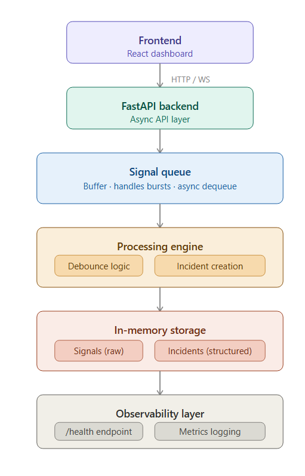

# 🚨 Incident Management System (IMS)

## 📌 Overview

This project is a simplified **Incident Management System** inspired by real-world Site Reliability Engineering (SRE) practices.

In large-scale distributed systems, thousands of signals (errors, latency spikes, crashes) are generated continuously. This system demonstrates how such signals can be:

* Ingested efficiently at scale
* Buffered and processed asynchronously
* Grouped into meaningful incidents
* Managed through a lifecycle
* Resolved with structured Root Cause Analysis (RCA)

The goal is to simulate how production systems maintain **reliability, stability, and observability under load**.

---

## 🏗️ Architecture Diagram




Frontend (React Dashboard)
        ↓
FastAPI Backend (Async API)
        ↓
----------------------------
| Signal Queue (Buffer)     |
| - Handles bursts          |
----------------------------
        ↓
----------------------------
| Processing Engine         |
| - Debounce Logic          |
| - Incident Creation       |
----------------------------
        ↓
----------------------------
| In-Memory Storage         |
| - Signals (Raw)           |
| - Incidents (Structured)  |
----------------------------
        ↓
----------------------------
| Observability Layer       |
| - /health endpoint        |
| - Metrics logging         |
----------------------------
```

---

## 🧠 Architecture Explanation

### Flow

1. **Frontend (React Dashboard)**
   Displays incidents, allows interaction, and captures RCA inputs.

2. **FastAPI Backend**
   Handles ingestion, processing, and lifecycle transitions.

3. **Signal Queue (Backpressure Buffer)**
   Temporarily stores incoming signals to prevent overload.

4. **Processing Engine**
   Applies debounce logic and groups signals into incidents.

5. **In-Memory Storage**
   Stores signals (raw data) and incidents (structured records).

6. **Observability Layer**
   Provides health status and logs throughput metrics.

---

## ⚙️ Tech Stack

| Layer    | Technology |
| -------- | ---------- |
| Frontend | React.js   |
| Backend  | FastAPI    |
| Storage  | In-memory  |
| API Docs | Swagger UI |

---

## 🚀 Setup Instructions (Docker Compose)

### 1. docker-compose.yml

```yaml
version: "3.9"

services:
  backend:
    build: ./backend
    ports:
      - "8000:8000"

  frontend:
    build: ./frontend
    ports:
      - "3000:3000"
```

---

### 2. Backend Dockerfile

```dockerfile
FROM python:3.10

WORKDIR /app
COPY . .
RUN pip install fastapi uvicorn

CMD ["uvicorn", "main:app", "--host", "0.0.0.0", "--port", "8000"]
```

---

### 3. Frontend Dockerfile

```dockerfile
FROM node:18

WORKDIR /app
COPY . .
RUN npm install

CMD ["npm", "start"]
```

---

### 4. Run Application

```bash
docker-compose up --build
```

Backend:

```
http://127.0.0.1:8000/docs
```

Frontend:

```
http://localhost:3000
```

---

## ⚡ Backpressure Handling

Backpressure is handled using multiple strategies:

### 1. Rate Limiting

* Limits ingestion to 100 requests/sec
* Prevents API overload

### 2. Queue-Based Processing

* Signals are added to a queue
* Processed asynchronously
* Avoids blocking API requests

### 3. Debounce Logic

* Groups repeated signals into one incident
* Reduces noise and improves efficiency

### Why It Matters

These mechanisms ensure:

* Stability under high load
* Prevention of cascading failures
* Efficient resource utilization

---

## 🧪 Sample Data (Failure Simulation)

Create `sample_events.json`

```json
[
  {"component_id": "DB_MAIN", "message": "Database connection timeout"},
  {"component_id": "DB_MAIN", "message": "Database crash"},
  {"component_id": "CACHE_CLUSTER", "message": "Cache latency spike"},
  {"component_id": "MCP_SERVICE", "message": "Service unavailable"}
]
```

---

### Simulation Script

```python
import requests

events = [
    ("DB_MAIN", "Database crash"),
    ("DB_MAIN", "Timeout"),
    ("CACHE_CLUSTER", "Cache spike"),
    ("MCP_SERVICE", "Service down")
]

for comp, msg in events:
    requests.post(
        f"http://127.0.0.1:8000/ingest?component_id={comp}&message={msg}"
    )
```

---

## 🔥 Features

* High-throughput signal ingestion
* Debounce-based incident creation
* Lifecycle management (OPEN → CLOSED)
* Mandatory RCA enforcement
* MTTR calculation
* Severity-based prioritization
* Real-time dashboard
* Expandable incident details
* Toast notifications

---

## 🧾 AI Prompts / Design Inputs

### System Design

> Design a scalable incident management system that can handle high-frequency signals and enforce structured RCA before closure.

### Backend

> Implement async ingestion in FastAPI with rate limiting and queue processing.

### Frontend

> Build a React dashboard with live feed, severity sorting, and RCA workflow UI.

### Optimization

> Improve UI/UX to resemble production SaaS dashboards.

---

## 🎯 Future Improvements

* PostgreSQL integration
* Redis caching layer
* Kafka for streaming ingestion
* Authentication and role-based access
* Advanced analytics dashboard

---

## 👨‍💻 Author

Santhosha Mohananda

---

